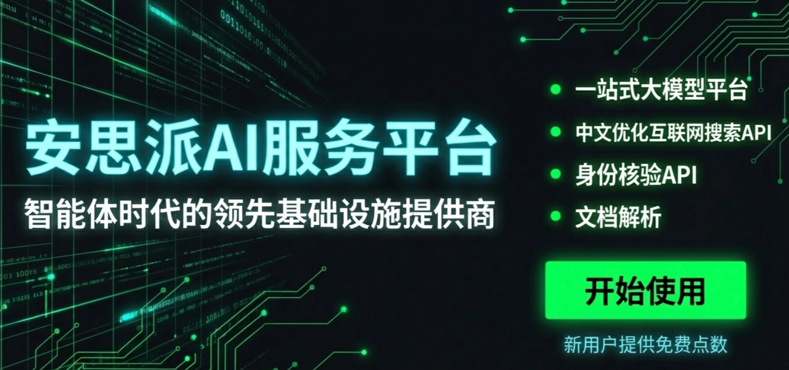

<div align="center">

# AI Stock Analysis System

[](https://github.com/ZhuLinsen/daily_stock_analysis/stargazers)
[](https://github.com/ZhuLinsen/daily_stock_analysis/actions/workflows/ci.yml)
[](https://opensource.org/licenses/MIT)
[](https://www.python.org/downloads/)
[](https://github.com/features/actions)
[](https://hub.docker.com/r/zhulinsen/daily_stock_analysis)

<p align="center">
  <a href="https://trendshift.io/repositories/18527" target="_blank"></a>
  <a href="https://hellogithub.com/repository/ZhuLinsen/daily_stock_analysis" target="_blank"></a>
</p>

**AI-powered stock analysis system for A-shares / Hong Kong / US stocks**

Analyze your watchlist daily -> generate a decision dashboard -> push to Telegram / Discord / Slack / Email / WeChat Work / Feishu.

[**Key Features**](#-key-features) · [**Quick Start**](#-quick-start) · [**Sample Output**](#-sample-output) · [**Full Guide**](./full-guide_EN.md) · [**FAQ**](./FAQ_EN.md) · [**Changelog**](./CHANGELOG.md)

> This PR-doc update is documentation-only and does not introduce runtime implementation changes. Provider recommendations for Anspire / AIHubMix / SerpAPI reflect existing runtime capabilities and configuration semantics.

English | [简体中文](../README.md) | [繁體中文](README_CHT.md)

</div>

## 💖 Sponsors

<div align="center">
  <p align="center">
    <a href="https://open.anspire.cn/?share_code=QFBC0FYC" target="_blank"></a>
    <a href="https://serpapi.com/baidu-search-api?utm_source=github_daily_stock_analysis" target="_blank"></a>
  </p>
</div>

## ✨ Key Features

| Module | Feature | Description |
|--------|---------|-------------|
| AI | Decision Dashboard | One-sentence conclusion + score + entry/exit levels + risk alerts + action checklist |
| Analysis | Multi-dimensional Analysis | Technicals, realtime quotes, chip distribution, news sentiment, announcements, capital flow, and fundamentals |
| Market | Global Markets | A-shares, Hong Kong stocks, US stocks, US indices, and common ETFs |
| Strategy | Market Strategy System | A-share review, US regime strategy, moving averages, Chan theory, Elliott wave, and sentiment-cycle support |
| Review | Market Review | Daily market overview, index performance, breadth, and sector strength (supports cn / hk / us / both) |
| Web | Dual-theme Workspace | Manual analysis, settings, task progress, history, backtest, and portfolio management |
| Import | Smart Import & Autocomplete | Image, CSV/Excel, and clipboard import; search by code, name, pinyin, and aliases |
| History | Report Management | Full Markdown reports, rerun analysis, history browsing, and batch management |
| Backtest | AI Backtest Validation | Validate historical analysis with directional accuracy and simulated return views |
| Agent Q&A | Strategy Chat | Multi-turn strategy chat with 11 built-in strategies across Web/Bot/API |
| Notifications | Multi-channel Push | WeChat Work, Feishu, Telegram, Discord, Slack, Email, and more |
| Automation | Scheduled Runs | GitHub Actions, Docker, local scheduler, and FastAPI service mode |

> Detailed fields, fundamental P0 timeout semantics, trading rules, data-source priority, Web/API behavior, and troubleshooting live in the [Full Guide](./full-guide_EN.md).

### Tech Stack & Data Sources

| Type | Supported |
|------|-----------|
| AI Models | [Anspire](https://open.anspire.cn/?share_code=QFBC0FYC), [AIHubMix](https://aihubmix.com/?aff=CfMq), Gemini, OpenAI-compatible providers, DeepSeek, Qwen, Claude, Ollama |
| Market Data | [TickFlow](https://tickflow.org/auth/register?ref=WDSGSPS5XC), AkShare, Tushare, Pytdx, Baostock, YFinance, Longbridge |
| News Search | [Anspire](https://open.anspire.cn/?share_code=QFBC0FYC), [SerpAPI](https://serpapi.com/baidu-search-api?utm_source=github_daily_stock_analysis), [Tavily](https://tavily.com/), [Bocha](https://open.bocha.cn/), [Brave](https://brave.com/search/api/), [MiniMax](https://platform.minimaxi.com/), SearXNG |
| Social Sentiment | [Stock Sentiment API](https://api.adanos.org/docs) for Reddit / X / Polymarket, US stocks only |

> Full behavior is documented in [Data Source Configuration](./full-guide_EN.md#data-source-configuration).

## 🚀 Quick Start

### Option 1: GitHub Actions (Recommended)

> Deploy in about 5 minutes, with no server and no infrastructure cost.

#### 1. Fork this repository

Click `Fork` in the upper-right corner. A star is very welcome if this project helps you.

#### 2. Configure Secrets

Open your forked repository, then go to `Settings` -> `Secrets and variables` -> `Actions` -> `New repository secret`.

**AI model configuration (configure at least one)**

Start with one provider and one API key. For multi-model routing, image recognition, local models, or advanced routing, see the [LLM Config Guide](./LLM_CONFIG_GUIDE_EN.md).

| Secret Name | Description | Required |
|-------------|-------------|:--------:|
| `ANSPIRE_API_KEYS` | [Anspire](https://open.anspire.cn/?share_code=QFBC0FYC) API key, one key for popular LLMs and web search with free quota for this project | **Recommended** |
| `AIHUBMIX_KEY` | [AIHubMix](https://aihubmix.com/?aff=CfMq) API key, one key for multiple model families and a 10% top-up discount for this project | **Recommended** |
| `GEMINI_API_KEY` | Google Gemini API key | Optional |
| `ANTHROPIC_API_KEY` | Anthropic Claude API key | Optional |
| `OPENAI_API_KEY` | OpenAI-compatible API key, including DeepSeek and Qwen-compatible services | Optional |
| `OPENAI_BASE_URL` / `OPENAI_MODEL` | Fill these when using an OpenAI-compatible provider | Optional |

> Ollama is better suited for local or Docker deployment. GitHub Actions is usually smoother with a cloud API.

**Notification channels (configure at least one)**

| Secret Name | Description |
|-------------|-------------|
| `WECHAT_WEBHOOK_URL` | WeChat Work bot |
| `FEISHU_WEBHOOK_URL` | Feishu bot |
| `TELEGRAM_BOT_TOKEN` + `TELEGRAM_CHAT_ID` | Telegram |
| `DISCORD_WEBHOOK_URL` | Discord webhook |
| `SLACK_BOT_TOKEN` + `SLACK_CHANNEL_ID` | Slack bot |
| `EMAIL_SENDER` + `EMAIL_PASSWORD` | Email push |

More channels, signatures, email groups, and Markdown-to-image settings are in [Notification Configuration](./full-guide_EN.md#notification-channel-configuration).

**Watchlist (required)**

| Secret Name | Description | Required |
|-------------|-------------|:--------:|
| `STOCK_LIST` | Watchlist codes, such as `600519,hk00700,AAPL,TSLA` | ✅ |

**News sources (recommended)**

News search strongly improves sentiment, announcements, events, and catalyst quality. Configure at least one search provider if possible.

| Secret Name | Description | Required |
|-------------|-------------|:--------:|
| `ANSPIRE_API_KEYS` | [Anspire AI Search](https://aisearch.anspire.cn/), optimized for Chinese content and A-share analysis; the same key can also be used for Anspire LLM fallback examples | Recommended |
| `SERPAPI_API_KEYS` | [SerpAPI](https://serpapi.com/baidu-search-api?utm_source=github_daily_stock_analysis), search-engine results for realtime financial news | Recommended |
| `TAVILY_API_KEYS` | [Tavily](https://tavily.com/), general news search API | Optional |
| `BOCHA_API_KEYS` | [Bocha](https://open.bocha.cn/), Chinese search with AI summaries | Optional |
| `BRAVE_API_KEYS` | [Brave Search](https://brave.com/search/api/), privacy-first search and US-stock news enrichment | Optional |
| `MINIMAX_API_KEYS` | [MiniMax](https://platform.minimaxi.com/), structured search results | Optional |
| `SEARXNG_BASE_URLS` | Self-hosted SearXNG instances for quota-free fallback | Optional |

More search providers, social sentiment, and fallback behavior are in [Search Configuration](./full-guide_EN.md#search-service-configuration).

#### 3. Enable Actions

Open the `Actions` tab and click `I understand my workflows, go ahead and enable them`.

#### 4. Manual Test

`Actions` -> `Daily Stock Analysis` -> `Run workflow` -> `Run workflow`.

#### Done

By default, the workflow runs every weekday at 18:00 Beijing time and skips non-trading days. Forced runs, trading-day checks, and resume rules are covered in the [Full Guide](./full-guide_EN.md#scheduled-task-configuration).

### Option 2: Local / Docker Deployment

```bash
# Clone the project
git clone https://github.com/ZhuLinsen/daily_stock_analysis.git && cd daily_stock_analysis

# Install dependencies
pip install -r requirements.txt

# Configure environment variables
cp .env.example .env && vim .env

# Run analysis
python main.py
```

Common commands:

```bash
python main.py --debug
python main.py --dry-run
python main.py --stocks 600519,hk00700,AAPL
python main.py --market-review
python main.py --schedule
python main.py --serve-only
```

> Docker deployment, scheduling, and cloud-server WebUI access are documented in the [Full Guide](./full-guide_EN.md).

## 📱 Sample Output

### Decision Dashboard

```markdown
🎯 2026-02-08 Decision Dashboard
Analyzed 3 stocks | 🟢 Buy:0 🟡 Watch:2 🔴 Sell:1

📊 Summary
🟡 000657: Watch | Score 65 | Bullish
🟡 600105: Watch | Score 48 | Range-bound
🔴 300260: Sell | Score 35 | Bearish

🚨 Risk Alerts:
Risk 1: Main-force funds showed notable outflow.
Risk 2: Chip concentration suggests short-term resistance.

✨ Positive Catalysts:
Catalyst 1: AI-server supply-chain exposure remains a market focus.
Catalyst 2: Recent earnings growth provides fundamental support.
```

### Market Review

```markdown
🎯 2026-01-10 Market Review

📊 Major Indices
- SSE Composite: 3250.12 (+0.85%)
- SZSE Component: 10521.36 (+1.02%)
- ChiNext: 2156.78 (+1.35%)

📈 Market Breadth
Up: 3920 | Down: 1349 | Limit up: 155 | Limit down: 3
```

## ⚙️ Configuration

Full environment variables, model routing, notification channels, data-source priority, trading rules, fundamental P0 semantics, and deployment details are in the [Full Guide](./full-guide_EN.md).

## 🖥️ Web UI


The Web workspace supports settings, task monitoring, manual analysis, history reports, backtest, portfolio management, smart import, and light/dark themes.

```bash
python main.py --webui
python main.py --webui-only
```

Visit `http://127.0.0.1:8000`. Authentication, smart import, autocomplete, report copying, and cloud-server access are documented in [Local WebUI Management](./full-guide_EN.md#local-webui-management-interface).

## 🤖 Agent Strategy Chat

After configuring any available AI API key, the Web `/chat` page can use strategy chat. Set `AGENT_MODE=false` only if you want to disable it explicitly.

- Built-in strategies include moving-average crossovers, Chan theory, Elliott wave, bull trend, and more
- Calls realtime quotes, K-line data, technical indicators, news, and risk context
- Supports follow-up questions, session export, notification sending, and background execution
- Supports custom strategy files and experimental multi-agent orchestration

> Agent parameters, `skill` naming compatibility, multi-agent mode, and budget guards are covered in the [Full Guide](./full-guide_EN.md#local-webui-management-interface) and [LLM Config Guide](./LLM_CONFIG_GUIDE_EN.md).

## Related Projects

DSA focuses on daily analysis reports. These sibling projects cover stock screening, strategy validation, and strategy evolution for users who want to extend the workflow. They are maintained independently today, with candidate import, backtest validation, and report handoff planned as future integration directions.

- [AlphaSift](https://github.com/ZhuLinsen/alphasift): multi-factor stock screening and full-market scanning for building candidate watchlists.
- [AlphaEvo](https://github.com/ZhuLinsen/alphaevo): strategy backtesting and self-evolution experiments for validating rules and iteratively exploring strategy parameters and combinations.

## 🗺️ Roadmap

See supported features and release notes in the [Changelog](./CHANGELOG.md). Suggestions are welcome through [GitHub Issues](https://github.com/ZhuLinsen/daily_stock_analysis/issues).

> UI pages are still being polished. Please report style, interaction, or compatibility issues through Issues or Pull Requests.

---

## ☕ Support the Project

| Alipay | WeChat Pay | Xiaohongshu |
| :---: | :---: | :---: |
|  |  |  |

## 📄 License

[MIT License](../LICENSE) © 2026 ZhuLinsen

If you use or build on this project, attribution with a link back to this repository is appreciated.

## 📞 Contact

- GitHub Issues: [Report bugs or request features](https://github.com/ZhuLinsen/daily_stock_analysis/issues)
- Discussions: [Join discussions](https://github.com/ZhuLinsen/daily_stock_analysis/discussions)
- Email: zhuls345@gmail.com (sponsorship, custom development, private deployment, and integration work)

## ⭐ Star History

**Star this repo if you find it useful.**

<a href="https://star-history.com/#ZhuLinsen/daily_stock_analysis&Date">
 <picture>
   <source media="(prefers-color-scheme: dark)" srcset="https://api.star-history.com/svg?repos=ZhuLinsen/daily_stock_analysis&type=Date&theme=dark" />
   <source media="(prefers-color-scheme: light)" srcset="https://api.star-history.com/svg?repos=ZhuLinsen/daily_stock_analysis&type=Date" />
   
 </picture>
</a>

## ⚠️ Disclaimer

This project is for informational and educational purposes only. AI-generated analysis is not investment advice. Stock market investing involves risk; do your own research and consult a licensed financial advisor when needed.
